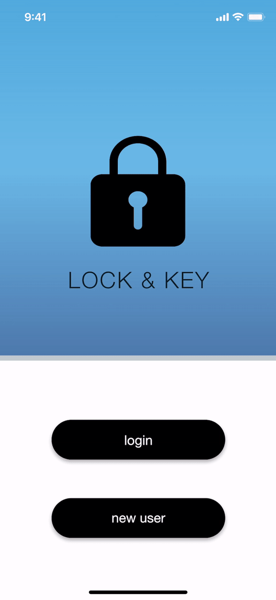

# Lock & Key

### [See Demos](#description)
### [Try It Out](https://xd.adobe.com/view/3bf190e4-40a7-4db4-59ca-d227f224b3fe-4dc0/?fullscreen)

### DESCRIPTION

- [**Lock&Key.xd**](Lock&Key.xd) is an Adobe XD prototype of a password management app developed for iPhone X/XS/11 Pro.

- The app creates and stores unique, secure passwords for a user to use in any accounts he or she has.
  - It does this by adding random numbers, symbols and capitalization to a "base password" which the user chooses.
 
 

Create User                     | Login & Home Screen       | Add Account                     | Menus 
:------------------------------:|:-------------------------:|:-------------------------------:|:-------------------------:
      |       |       | 
